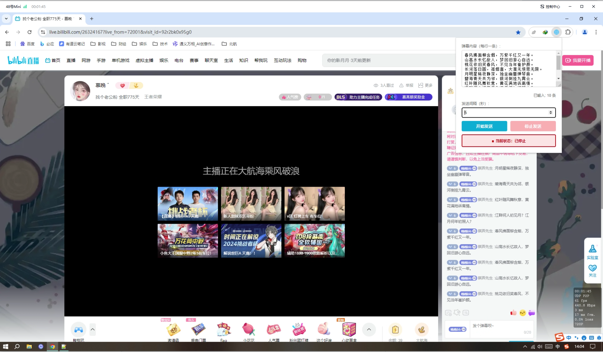

# Chrome-Bilibili-Barrage

B站直播弹幕自动发送助手 - Chrome扩展

## 界面预览



## 项目简介

Chrome-Bilibili-Barrage 是一个帮助用户在B站直播间自动发送弹幕的Chrome扩展。它提供了简单易用的界面，支持多条弹幕循环发送，可自定义发送间隔，并且具有实时状态显示功能。

## 功能特点

- 自动发送B站直播弹幕
- 支持多条弹幕循环发送
- 可自定义发送间隔时间
- 实时显示发送状态
- 可随时开始/停止发送
- 自动保存设置内容
- 美观的用户界面
- 详细的运行日志

## 技术架构

### 前端技术
- HTML5
- CSS3 (动画、过渡效果)
- JavaScript (ES6+)
- Chrome Extension API

### 主要组件
1. **Popup界面** (`popup/`)
   - `popup.html`: 用户界面
   - `popup.js`: 界面交互逻辑
   - 使用Flex布局
   - 响应式设计
   - 实时状态显示

2. **Content Script** (`content/`)
   - `content.js`: 页面注入脚本
   - 模拟用户输入
   - DOM操作
   - 事件模拟

3. **图标资源** (`icons/`)
   - 多尺寸图标支持
   - 自动生成脚本

### 核心功能实现
- Chrome消息通信机制
- DOM事件模拟
- 异步操作处理
- 状态管理
- 数据持久化

## 快速开始

### 安装方法

1. 克隆项目代码
```bash
git clone https://github.com/wangrongguo/chrome-bilibili-barrage.git
```

2. 打开Chrome浏览器，进入扩展管理页面：`chrome://extensions/`
3. 开启"开发者模式"
4. 点击"加载已解压的扩展程序"
5. 选择项目文件夹

### 使用方法

1. 进入B站直播间页面
2. 点击Chrome工具栏中的扩展图标
3. 在弹出窗口中：
   - 输入要发送的弹幕内容（每行一条）
   - 设置发送间隔时间（秒）
   - 点击"开始发送"按钮
4. 可以通过"停止发送"按钮随时停止

## 注意事项

1. **使用环境**
   - 仅支持B站直播页面（https://live.bilibili.com/）
   - 需要Chrome浏览器
   - 需要登录B站账号

2. **功能限制**
   - 发送间隔必须大于等于1秒
   - 页面刷新后需要重新开始
   - 不支持特殊弹幕（如礼物、表情等）

3. **安全提示**
   - 请合理使用，避免频繁发送
   - 遵守B站直播间规则
   - 不要发送违规内容

4. **故障排除**
   - 如果无法发送，请刷新页面重试
   - 确保在正确的直播间页面
   - 查看控制台日志以获取详细错误信息

## 开发说明

### 项目结构
```
chrome-bilibili-barrage/
├── manifest.json        # 扩展配置文件
├── popup/              # 弹出窗口
│   ├── popup.html     # 弹出窗口界面
│   └── popup.js       # 弹出窗口逻辑
├── content/           # 内容脚本
│   └── content.js     # 页面注入脚本
├── icons/             # 图标资源
│   ├── home.PNG      # 界面预览图
│   └── generate_icons.html  # 图标生成工具
└── README.md          # 项目说明文档
```

### 开发环境
- Chrome浏览器
- 文本编辑器（推荐VS Code）
- Git版本控制

### 调试方法
1. 扩展管理页面的"检查视图"功能
2. Chrome开发者工具的Console面板
3. 实时日志输出

## 更新日志

### v1.0.0 (2024-01-10)
- 初始版本发布
- 基本弹幕发送功能
- 用户界面实现
- 状态管理系统
- 开始/停止功能
- 设置保存功能

## 贡献指南

1. Fork 项目
2. 创建功能分支 (`git checkout -b feature/AmazingFeature`)
3. 提交更改 (`git commit -m 'Add some AmazingFeature'`)
4. 推送到分支 (`git push origin feature/AmazingFeature`)
5. 提交 Pull Request

## 许可证

本项目采用 MIT 许可证 - 查看 [LICENSE](LICENSE) 文件了解详细信息

## 作者

- GitHub: [@wangrongguo](https://github.com/wangrongguo)

## 致谢

- 感谢B站提供的平台
- 感谢所有贡献者的支持 